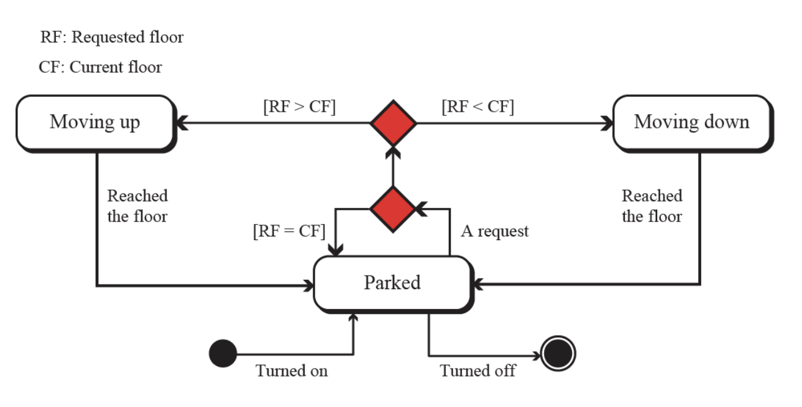
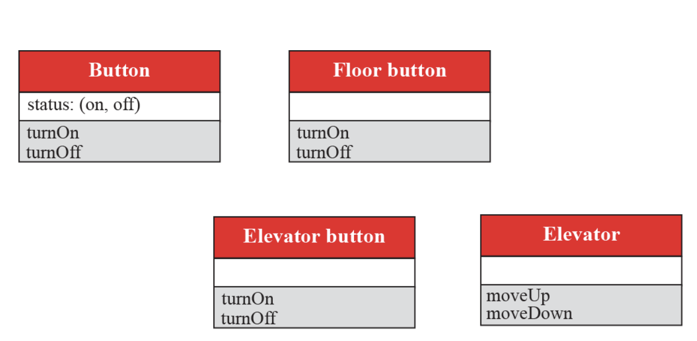
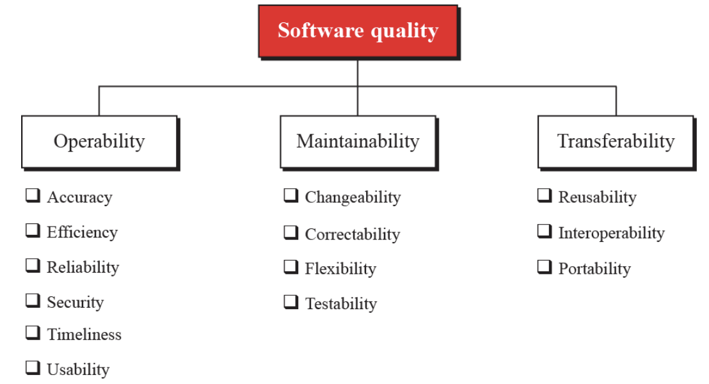
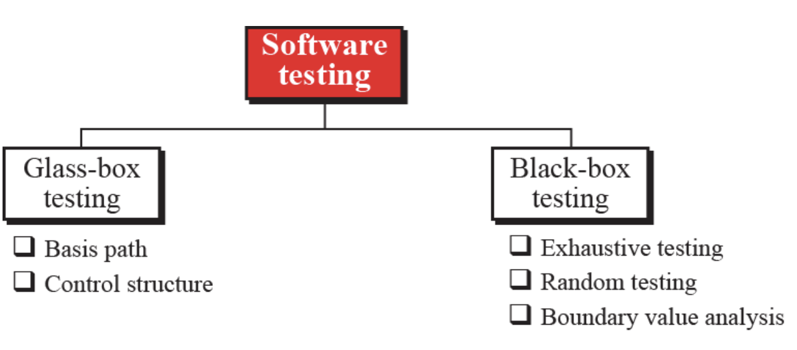

## ch.10 Software Engineering

### 大綱－本章介紹

- 軟體生命週期
- 開發流程
    - waterfall 瀑布式
    - incremental models 漸進式

- 四種步驟(階段)
    - 分析 
        - procedure based
        - object-oriented
    - 設計：也是分成上面兩種
    - 實作：寫程式、軟體的品質、度量的方法
    - 測試：玻璃箱(白箱)、黑箱

``` 軟體工程會牽扯到很多文件撰寫```

- 使用者文件
- 系統文件
- 技術性的文件

### 軟體生命週期


obsolete 過時的

Modification 調整修正

通常在 使用、修改 的階段是時間最長的

### Development Process 開發流程

不管哪種流程
都會有```分析 設計 實作 測試```這四個階段

### waterfall model 瀑布式開發

- 每個階段都全部做完 才進入下一個階段
- 就像水流一樣 因此得名
- 例如：所有的分析工作都完成時才進入設計階段
- 但在某階段出現錯誤時，是可以倒退回上一個階段，全部修完之後再進入下一階段
- 跟傳統的工程(土木、機械等等)很像

### Incremental model 漸進式開發


x軸 時間
y軸 功能完成程度

- 例如：
Increment1完成第一個功能 (四個階段都走一遍)
Increment2完成第二個功能 (四個階段都走一遍)
．．．
- 每個階段都只完成那個increment的部分

- 是比較新的思維

```沒有哪個比較好、只有誰比較適合哪種情況```

- 小程式小團隊適合漸進式


##### 接著介紹開發流程的四個階段

#### Analysis Phase 分析階段
- 又稱為 需求工程
- 搞清楚需要什麼功能
- output: (寫著功能/需求的) 規格文件、需求規格書
- 處理 what the software will do、what a system should be
- 不討論 how it will be done
- (前面說過)又分成兩種做法：procedural(程序導向)的 或是oo(物件導向)的

以下將這兩個做法的analysis分開說明

##### procedural oriented Analysis 分析階段：程序導向

- 比較早出現
- 比較直覺
- 軟體由一連串的procedurals組成
- Data flow diagrams (dfd)

    - 描述資料的流向 動態的
    - 有哪些處理資料的單元
    - data被哪些procedurals處理
    - 來源、去哪、如何流動
    - 整個系統裡的procedurals也可稱為process 處理資料的單元
    
- Entity-relationship diagrams (er圖)

    - 在關聯式資料庫很常見
    - 很像是excel表單 描述欄位、資料的關係
    - 可用來描述資料的結構、靜態的關聯
    - 既然如此那就ch.12再介紹


- State diagrams (狀態圖)

    - 描述系統裡狀態的改變
    - 有events事件、刺激、
    - 可用來描述系統裡狀態的轉移
    - 舉例：電梯系統
    
    - 停住 上移 下移 三種狀態
    - 基本的刺激 turn on/off
    - 收到request 請求 進行判斷 


##### Object-oriented analysis 分析階段：物件導向

註：人們常說的ｏｏ就是這個歐歐

- 較流行、常見、大二的系統課會再出現

- 以前介紹的流程圖也只是uml的一種、這裡介紹常用的uml圖種和觀念

- Use case diagrams（使用案例圖）

    - 從使用者的角度來看
    - 描述使用者的操作
    - 四個主要元件 system系統(灰色大框框)、use cases(紅色圓角框)、actors、relationships

- Class diagrams（類別圖）

    - 描述系統裡有哪些類別
    - 以及類別之間的關係
    - 類別(紅色矩形)
    註：instance：類別產生的實體，用范姜的話來說 就是被new出來的東西
    

- State chart (狀態圖)

    - 描述狀態之間的轉移
    - 比較靜態
    - 通常會給對類別圖上的每個類別都畫一個狀態圖


#### Design Phase 設計階段

- input: 需求文件
- 搞清楚該怎麼設計整個系統
- output: 設計文件
- 定義這個系統要怎麼滿足前面分析階段定義好的功能
- how it will be done
- (前面說過)又分成兩種做法：procedural(程序導向)的 或是oo(物件導向)的


以下將這兩個做法的design分開說明

##### procedural oriented design 設計階段：程序導向

- 主要元素 data資料、procedural處理資料的程序單元
- 比較直覺
- 跟前面說的一樣：軟體由一連串的procedurals組成
- Structure charts (結構圖)

    - 描述系統裡有哪些modules(模組)
    - 模組之間的關係、模組有什麼功能、怎麼處理資料
    - 大模組可以分解成小模組
    - 通常每個模組的功能都很明確很單一

- Modularity 模組化(的程度)

    - 很大很複雜的任務被切成小的模組
    - 小的模組互相獨立、盡量把關係分解到最少
    - 分得越小越容易懂
    - 
    - coupling 耦合度：互相bond(關聯／影響)的程度有多高
    - coupling 越鬆散越好、模組之間越獨立越好
    - 
    - cohesion 內聚力：模組內部的成分跟模組的主要目標的關聯程度
    - cohesion 越高越好
    - 通常cohesion越高 模組越獨立
    - 
    - 整體設計目標：loosely coupling 鬆散耦合、high cohesion 高度內聚


---

```c
 完蛋啦10-4沒辦法聽啊
```

---

##### oo design 設計階段：物件導向

- 說明class的細節
- 跟前面說的一樣：class由attributes和methods組成，此階段要詳細列出他們
- 舉例 電梯的uml圖 
    


---
##### 因為老師沒開放下載所以10-4聽不到講解錄音檔所以我就照貼ptt的文字啦哈哈哈哈哈
---


#### Implementation Phase 實作階段

- programmers write the code for the modules in procedure-oriented design, or write the program units to implement classes in object-oriented design.

- Choice of language 你團隊用什麼導向就選適合的語言、課本說想選即使是程序導向但你要用c++也沒問題

<p style=color:grey;font-size:10px>讀者註：第四代高階語言幾乎都有class可以寫，所以主要其實看開發環境和需求決定：需要大量運算建議c/c++，要快速開發測試可選python，有統計目的通常選Ｒ，要兼顧速度和嚴謹可試Golang</p>

- Software quality
    - satisfies the user’s requirements
    - meets the operating standards of the organization
    - runs efficiently on the hardware for which it was developed

- Software quality factors
    - operability
    - maintainability 
    - transferability
    

#### Test Phase 測試階段

- find errors
- a good testing strategy is the one that finds most errors

    

##### Glass-box testing (white-box testing)

- knowing the internal structure of the software
- goal: to determine whether all components of the software do what they are designed for
- assumes that the tester knows everything about the software
- briefly discuss two of them: basis path testing and control structure testing. 

- Basis path testing
    - creates a set of test cases that executes every statement in the software at least once.

- Control structure testing
    - Condition testing
    - Data flow testing
    - Loop testing

##### Black-box testing

- without knowing what is inside it and without knowing how it works
- tests the functionality of the software in terms of what the software is supposed to accomplish

- Exhaustive testing
    - test the software for all possible values in the input domain
    - However, usually the input domain is so huge that it is often impractical to do so

- Random testing
    - a subset of values in the input domain is selected for testing
    - It is very important that the subset be chosen in such a way that the values are distributed over the domain input.

- Boundary-value testing
    - Errors often happen when boundary values are encountered. 
    