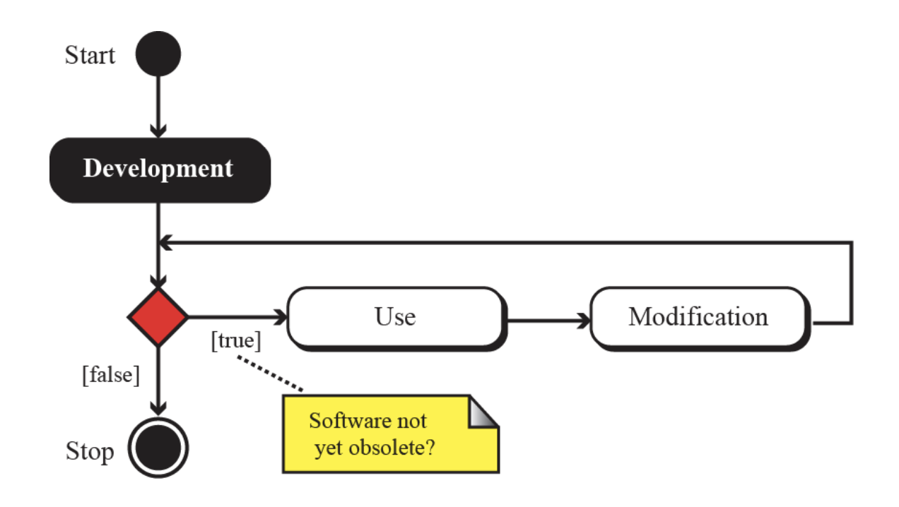
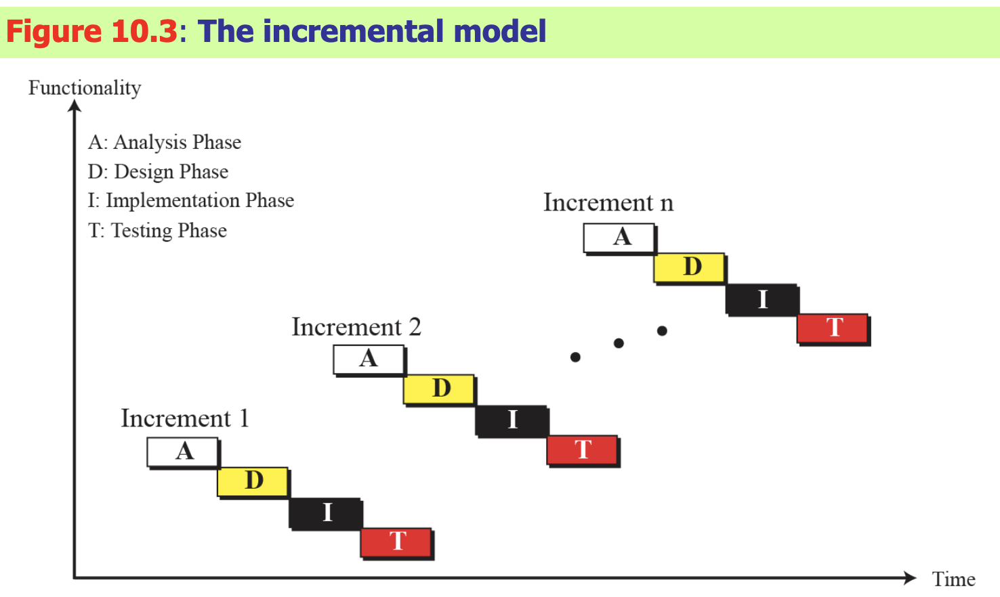

## ch.10 Software Engineering

### 大綱－本章介紹

- 軟體生命週期
- 開發流程
    - waterfall 瀑布式
    - incremental models 漸進式

- 四種步驟(階段)
    - 分析 
        - procedure based
        - object-oriented
    - 設計：也是分成上面兩種
    - 實作：寫程式、軟體的品質、度量的方法
    - 測試：玻璃箱(白箱)、黑箱

``` 軟體工程會牽扯到很多文件撰寫```

- 使用者文件
- 系統文件
- 技術性的文件

### 軟體生命週期

obsolete 過時的
Modification 調整修正

通常在 使用、修改 的階段是時間最長的

### Development Process 開發流程

不管哪種流程
都會有```分析 設計 實作 測試```這四個階段

### waterfall model 瀑布式開發

- 每個階段都全部做完 才進入下一個階段
- 就像水流一樣 因此得名
- 例如：所有的分析工作都完成時才進入設計階段
- 但在某階段出現錯誤時，是可以倒退回上一個階段，全部修完之後再進入下一階段
- 跟傳統的工程(土木、機械等等)很像

### Incremental model 漸進式開發


x軸 時間
y軸 功能完成程度

- 例如：
Increment1完成第一個功能 (四個階段都走一遍)
Increment2完成第二個功能 (四個階段都走一遍)
．．．
- 每個階段都只完成那個increment的部分

- ~是比較新的思維~

```沒有哪個比較好、只有誰比較適合哪種情況```

- 小程式小團隊適合漸進式


##### 接著介紹開發流程的四個階段

#### Analysis Phase 分析階段
- 又稱為 需求階段
- 得到一個功能/需求文件
- 處理 what the software will do
- 不討論 how it will be done
- (前面說過)又分成兩種做法：procedural的或是oo的